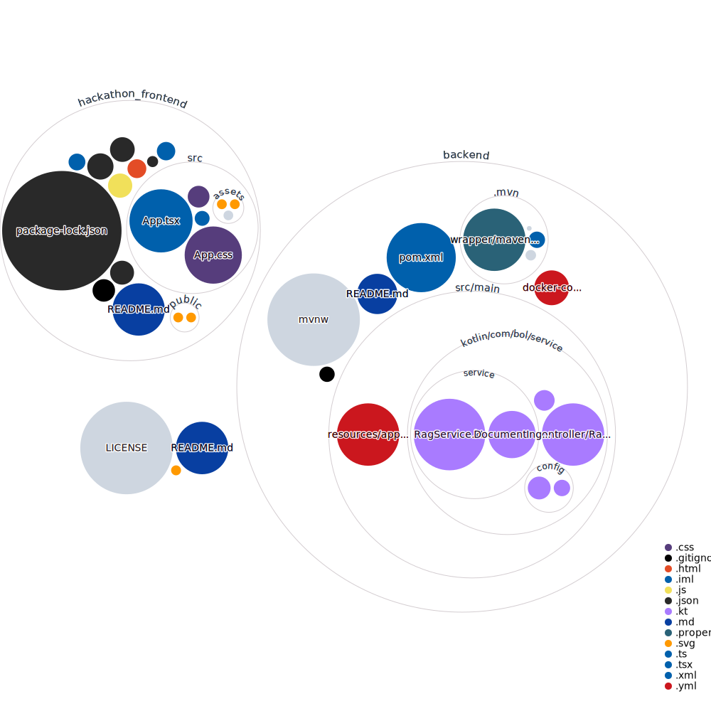

# Bol Recommerce Hackathon

This repository contains the code for the Bol Recommerce Hackathon project. It is split into two main directories: a `frontend` and a `backend`, which work together to form a full-stack application leveraging local Large Language Models (LLMs) and Retrieval-Augmented Generation (RAG).

## Tech Stack

### Frontend (`hackathon_frontend/`)
The frontend is a modern, lightweight web application built to interact with the backend AI services.
- **Framework:** React 19
- **Language:** TypeScript
- **Build Tool:** Vite
- **Styling:** CSS
- **Linting:** ESLint

### Backend (`backend/`)
The backend is a robust REST API that handles the business logic, document parsing, and AI integrations using the Spring ecosystem.
- **Framework:** Spring Boot 3.4
- **Language:** Kotlin 2.1
- **AI Integration:** Spring AI 1.0.0 (Ollama for local chat and embeddings)
- **Vector Database:** pgvector (PostgreSQL)
- **Document Processing:** Spring AI PDF Document Reader
- **API Documentation:** Swagger / OpenAPI (Springdoc)
- **Build Tool:** Maven

## Getting Started
Please refer to the respective directories for specific setup and execution instructions.