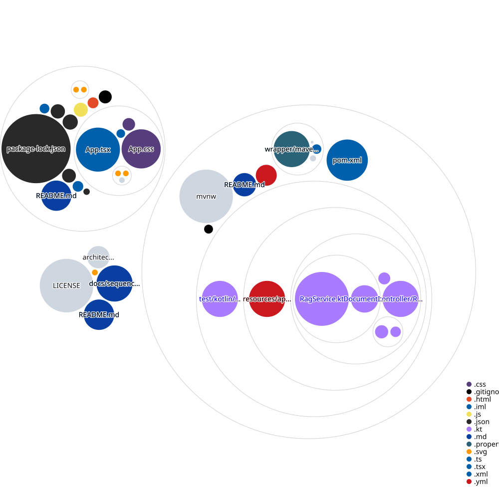
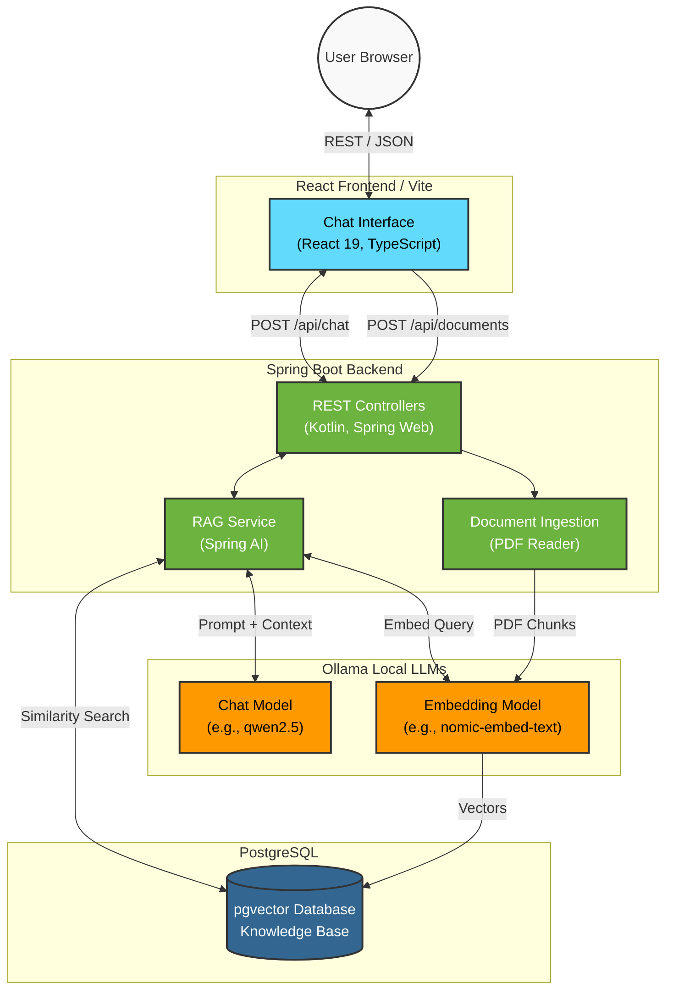
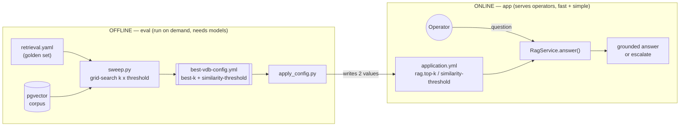

# Bol Recommerce Hackathon

This repository contains the code for the Bol Recommerce Hackathon project. It is split into two main directories: a `frontend` and a `backend`, which work together to form a full-stack application leveraging local Large Language Models (LLMs) and Retrieval-Augmented Generation (RAG).



## Architecture Overview


```mermaid
graph TD
    %% Define Styles
    classDef frontend fill:#61DAFB,stroke:#333,stroke-width:2px,color:#000
    classDef backend fill:#6DB33F,stroke:#333,stroke-width:2px,color:#fff
    classDef ai fill:#FF9900,stroke:#333,stroke-width:2px,color:#000
    classDef db fill:#336791,stroke:#333,stroke-width:2px,color:#fff
    classDef client fill:#f9f9f9,stroke:#333,stroke-width:2px

    %% Components
    Client((User Browser)):::client
    
    subgraph Frontend [React Frontend / Vite]
        UI["Chat Interface\n(React 19, TypeScript)"]:::frontend
    end
    
    subgraph Backend [Spring Boot Backend]
        API["REST Controllers\n(Kotlin, Spring Web)"]:::backend
        RAG["RAG Service\n(Spring AI)"]:::backend
        Ingest["Document Ingestion\n(PDF Reader)"]:::backend
    end
    
    subgraph Models [Ollama Local LLMs]
        LLM["Chat Model\n(e.g., qwen2.5)"]:::ai
        Embed["Embedding Model\n(e.g., nomic-embed-text)"]:::ai
    end
    
    subgraph Database [PostgreSQL]
        PGV[(pgvector Database\nKnowledge Base)]:::db
    end

    %% Interactions
    Client <-->|REST / JSON| UI
    UI <-->|POST /api/chat| API
    UI -->|POST /api/documents| API
    
    API <--> RAG
    API --> Ingest
    
    %% RAG Flow
    RAG <-->|Embed Query| Embed
    RAG <-->|Similarity Search| PGV
    RAG <-->|Prompt + Context| LLM
    
    %% Ingestion Flow
    Ingest -->|PDF Chunks| Embed
    Embed -->|Vectors| PGV

```

## Tech Stack

### Frontend (`hackathon_frontend/`)
The frontend is a modern, lightweight web application built to interact with the backend AI services.
- **Framework:** React 19
- **Language:** TypeScript
- **Build Tool:** Vite
- **Styling:** CSS
- **Linting:** ESLint

### Backend (`backend/`)
The backend is a robust REST API that handles the business logic, document parsing, and AI integrations using the Spring ecosystem.
- **Framework:** Spring Boot 3.4
- **Language:** Kotlin 2.1
- **AI Integration:** Spring AI 1.0.0 (Ollama for local chat and embeddings)
- **Vector Database:** pgvector (PostgreSQL)
- **Document Processing:** Spring AI PDF Document Reader
- **API Documentation:** Swagger / OpenAPI (Springdoc)
- **Build Tool:** Maven

## Getting Started
Please refer to the respective directories for specific setup and execution instructions.

### Running it
1. Run docker compose located in backend
2. Run frontend from hackathon_frontend
3. Run springboot application from backend

**Note:** 
4. Add knowledge base document via endpoint in backend

## Run with Docker (from scratch)

The whole stack (Postgres/pgvector, Ollama, backend, frontend) runs via Docker Compose — no JDK, Node, or Ollama needed on the host.

### 1. Build & start everything
```bash
cd backend
docker compose up -d --build
```
The first run downloads ~5 GB of Ollama models (`qwen2.5:3b-instruct`, `llava-phi3:3.8b`, `nomic-embed-text`) and builds the backend, so it takes a while — the backend only starts after the models finish pulling.

To start **truly** from scratch (drops the DB **and** the downloaded models):
```bash
docker compose down -v
docker compose up -d --build
```

Watch until all services are healthy:
```bash
docker compose ps
```

- Frontend UI: http://localhost:5173
- Backend / Swagger UI: http://localhost:8080/swagger-ui.html

### 2. Upload the knowledge-base PDF (Swagger)
1. Open http://localhost:8080/swagger-ui.html
2. `POST /api/documents` → **Try it out** → select your PDF for `files` → **Execute**.

Verify a single clean copy was ingested:
```bash
docker exec localrag-postgres psql -U postgres -d ragdb -c "SELECT count(*) FROM vector_store;"
```
Re-uploading the same PDF **appends** duplicate chunks (which skews retrieval) — truncate the table or use the eval seed (below) before re-uploading.

### 3. Start a chat
- In the UI (http://localhost:5173), type a question — optionally attach a photo of the item — and send; or
- via curl:
```bash
curl -s -F "question=The seal on the box is broken. What do I do?" http://localhost:8080/api/chat
```
The response contains the grounded `answer`, the source filenames (`sources`), and `responseTimeMs`.

### 4. Test the retrieval eval
The retrieval eval harness lives in `eval/` (details in [`eval/README.md`](./eval/README.md)). Copy the handbook PDF to `eval/handbook.pdf` first (gitignored).
```bash
cd backend
docker compose --profile eval run --rm eval python seed.py   # reset DB + ingest one clean copy
docker compose --profile eval run --rm eval                  # run eval -> recall@k, MRR, score gap
```
Results print as a table and are written to `eval/results.csv`.

## Retrieval quality: eval & auto-tuning

The `eval/` harness measures **and** tunes retrieval quality against a golden set of
warehouse questions, exercising the real retrieval pipeline (not a reimplementation).

### How eval and the app connect

The **offline** side does all the messy, slow, non-deterministic work (embeddings,
scoring, grid-searching thresholds) and distills it into a small **artifact**. The
**online** app never runs eval — it just reads two tuned numbers and serves users.


```mermaid
flowchart LR
    subgraph offline["OFFLINE — eval (run on demand, needs models)"]
        gold["retrieval.yaml<br/>(golden set)"]
        corpus[("pgvector<br/>corpus")]
        sweep["sweep.py<br/>grid-search k x threshold"]
        apply["apply_config.py"]
        gold --> sweep
        corpus --> sweep
        sweep --> artifact[["best-vdb-config.yml<br/>best-k + similarity-threshold"]]
        artifact --> apply
    end

    apply -->|writes 2 values| cfg["application.yml<br/>rag.top-k / similarity-threshold"]

    subgraph online["ONLINE — app (serves operators, fast + simple)"]
        user((Operator)) -->|question| answer["RagService.answer()"]
        cfg --> answer
        answer --> out["grounded answer<br/>or escalate"]
    end
```

The artifact (`best-vdb-config.yml`) is the **only** handoff. The app stays oblivious to
golden sets, similarity scores, and sweeps — it consumes `top-k` and `similarity-threshold`
and nothing else. Retune whenever the corpus or models change by re-running the offline
loop; production is never bothered by the technicalities of how the numbers were found.

**`POST /api/retrieve`** runs only the retrieval step (no LLM) and returns the matching
chunks with `page`, `source`, `score`, and `text`. Both `RagService.answer()` and the
harness call the same `retrieve()` method, so eval measures exactly what production does.

### Golden set — `eval/retrieval.yaml`
Hand-curated cases:
- **covered** — a question whose answer lives on a known handbook page (`expected_pages`,
  plus an optional `expected_keyword` for pages that mix topics).
- **not_covered** (negatives) — questions the handbook does not answer; retrieval should
  return nothing so the assistant escalates instead of inventing a policy.

### Measure — `harness.py`
Prints `recall@k`, `MRR`, and the covered-vs-negative score gap; writes `eval/results.csv`.

### Tune — `sweep.py` → `best-vdb-config.yml`
Grid-searches `(top-k, similarity-threshold)` for the config that best separates covered
from not-covered cases. Objective: maximise recall while rejecting at least
`REJECT_TARGET` (default: all) of the negatives; ties break toward a smaller `k` and a
higher, safer threshold. Produces:
```yaml
best-k: 3
similarity-threshold: 0.66
```

### Apply — `apply_config.py` → `application.yml`
Writes the tuned `rag.top-k` and `rag.similarity-threshold` back into
`backend/src/main/resources/application.yml` (comments preserved); restart the backend to
load them. At query time, chunks scoring below the threshold are dropped — and if nothing
survives, the assistant escalates rather than answering from weak matches.

The eval → sweep → apply loop lets you retune whenever the knowledge base or models change,
turning retrieval configuration into a measured decision instead of a guess. Full commands
and tuning knobs: [`eval/README.md`](./eval/README.md).
