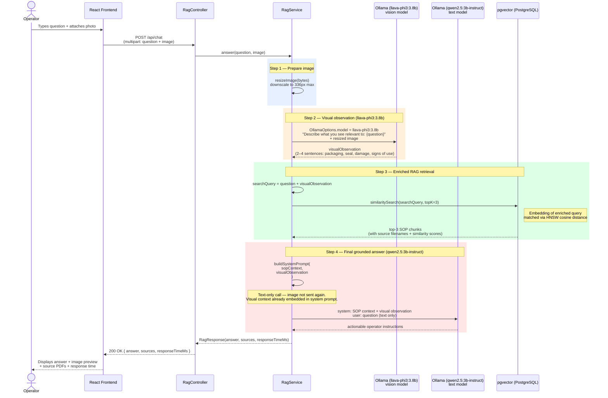

# Sequence Diagram — Image + Question Answer Flow

```mermaid
sequenceDiagram
    actor Operator
    participant Frontend as React Frontend
    participant Controller as RagController
    participant Service as RagService
    participant LLaVA as Ollama (llava-phi3:3.8b)<br/>vision model
    participant Qwen as Ollama (qwen2.5:3b-instruct)<br/>text model
    participant PGVector as pgvector (PostgreSQL)

    Operator->>Frontend: Types question + attaches photo
    Frontend->>Controller: POST /api/chat<br/>(multipart: question + image)
    Controller->>Service: answer(question, image)

    rect rgb(230, 240, 255)
        note over Service: Step 1 — Prepare image
        Service->>Service: resizeImage(bytes)<br/>downscale to 336px max
    end

    rect rgb(255, 240, 220)
        note over Service,LLaVA: Step 2 — Visual observation (llava-phi3:3.8b)
        Service->>LLaVA: OllamaOptions.model = llava-phi3:3.8b<br/>"Describe what you see relevant to: {question}"<br/>+ resized image
        LLaVA-->>Service: visualObservation<br/>(2–4 sentences: packaging, seal, damage, signs of use)
    end

    rect rgb(220, 255, 230)
        note over Service,PGVector: Step 3 — Enriched RAG retrieval
        Service->>Service: searchQuery = question + visualObservation
        Service->>PGVector: similaritySearch(searchQuery, topK=3)
        note right of PGVector: Embedding of enriched query<br/>matched via HNSW cosine distance
        PGVector-->>Service: top-3 SOP chunks<br/>(with source filenames + similarity scores)
    end

    rect rgb(255, 230, 230)
        note over Service,Qwen: Step 4 — Final grounded answer (qwen2.5:3b-instruct)
        Service->>Service: buildSystemPrompt(<br/>  sopContext,<br/>  visualObservation<br/>)
        note over Service: Text-only call — image not sent again.<br/>Visual context already embedded in system prompt.
        Service->>Qwen: system: SOP context + visual observation<br/>user: question (text only)
        Qwen-->>Service: actionable operator instructions
    end

    Service-->>Controller: RagResponse(answer, sources, responseTimeMs)
    Controller-->>Frontend: 200 OK { answer, sources, responseTimeMs }
    Frontend-->>Operator: Displays answer + image preview<br/>+ source PDFs + response time
```
